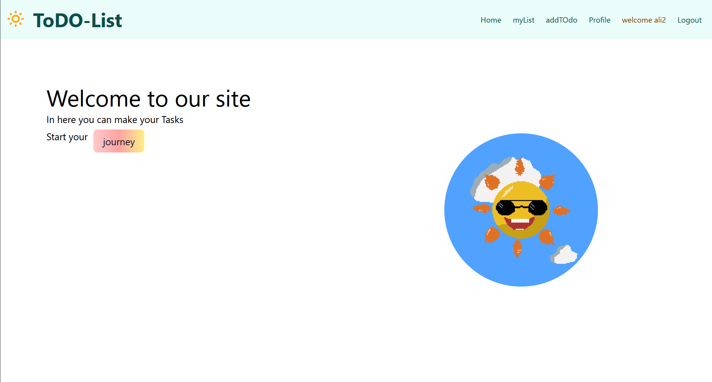
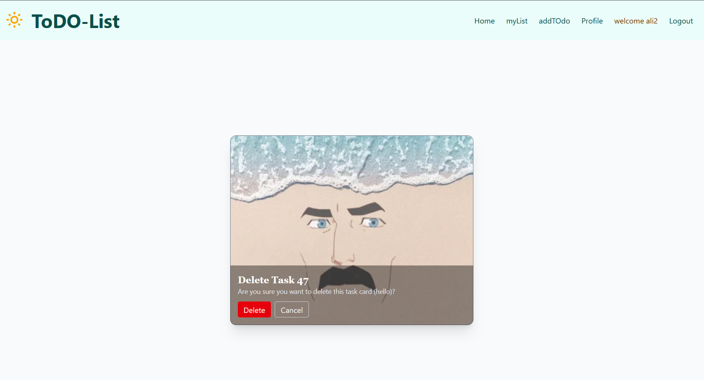

Hi everyone this is a todo list that i made with django and with python manage.py runserver you can run the project and see what I have Done.
# 📝 Django Todo List App

A simple Todo List web application built with Django.  
Users can add, edit, and delete tasks, and mark them as complete.

---

## 🚀 Features
- User authentication (sign up / login / logout)
- Add, edit, delete tasks
- Mark tasks as completed
- Responsive UI with TailwindCSS

---

## ScreenShots

